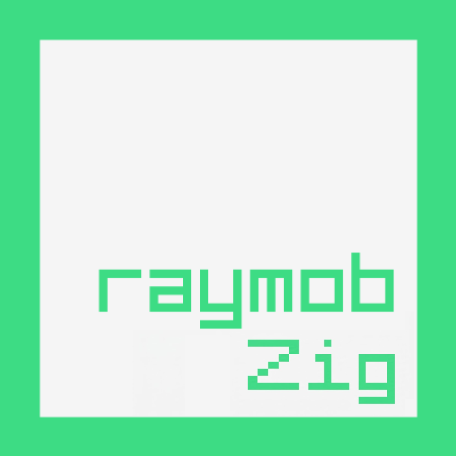

# raymob [](https://raylib.com) [](https://ziglang.org) [](https://developer.android.com/) [](LICENSE) [](LICENSE)

This is a fork of [raymob](https://github.com/Bigfoot71/raymob) using Zig as main language.

raymob is a simple implementation of [raylib](https://www.raylib.com/) for Android.

## Prerequisites

**You will need SDK API 36, NDK r28 and Zig 0.16.0**

If you already have this version of SDK and NDK without having Android Studio, you should still be able to compile the project using `gradlew.bat` for Windows or `gradlew` for Linux or MacOS.

## How to Use?

1. Clone the repository and automatically initialize and update all submodules:
   ```
   git clone --recurse-submodules https://github.com/maiconpintoabreu/raymob-zig.git
   ```
2. Open Project using Android Studio to finish the setup.
